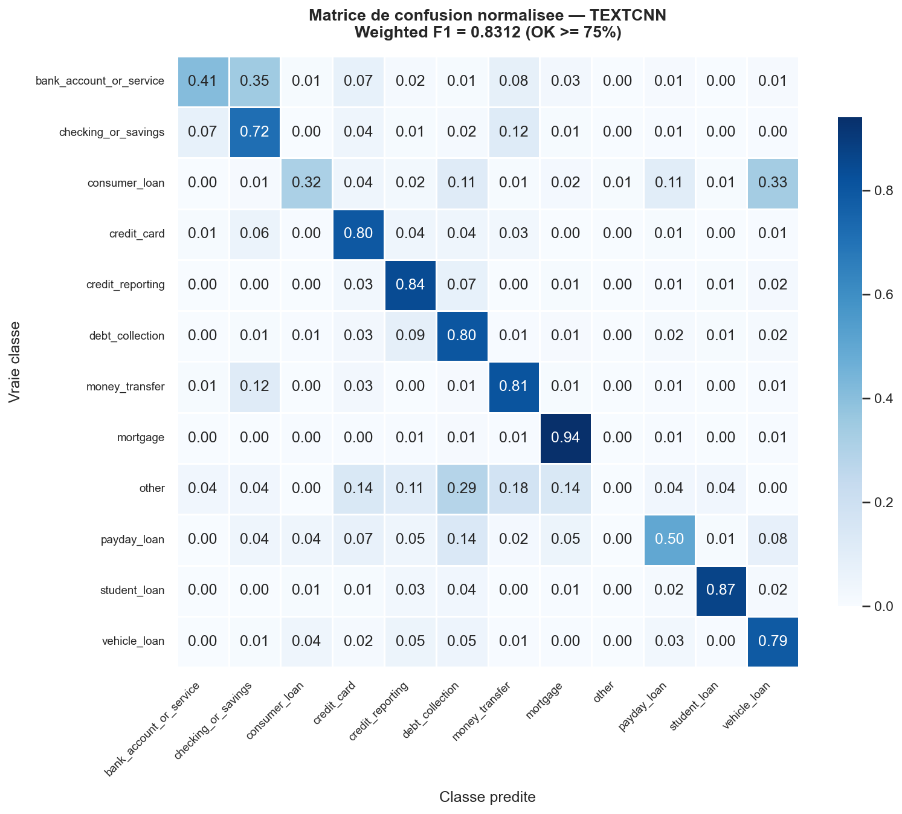
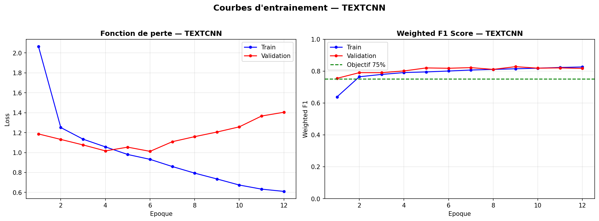

# 🏦 Claims Classifier — Classification automatique de réclamations clients

[](https://www.python.org/)
[](https://pytorch.org/)
[](https://github.com/astral-sh/uv)
[](https://opensource.org/licenses/MIT)
[](reports/figures/confusion_matrix_textcnn.png)
[](tests/)

> **Template PME** : modèle de Deep Learning NLP entraîné *from scratch* sur 300 000 réclamations
> clients réelles (CFPB). Déployable pour automatiser le routage de réclamations en entreprise.

---

## 🎯 Résultats

| Modèle | Weighted F1 | Macro F1 | Accuracy | Statut |
|--------|-------------|----------|----------|--------|
| Baseline aléatoire | ~8 % | ~8 % | ~8 % | référence |
| MLP *from scratch* | 81.16 % | 55.15 % | 79.74 % | ✅ |
| **TextCNN** *from scratch* | **83.12 %** | **59.35 %** | **82.30 %** | ✅ **Meilleur** |

**Objectif : Weighted F1 ≥ 75 % → Atteint à 83.12 %** 🎯

Entraîné sur GPU NVIDIA RTX 3090 — dataset CFPB 299 856 observations, 12 classes.

---

## 🏢 Contexte métier

Une entreprise reçoit chaque jour des centaines de réclamations clients textuelles.
Les trier manuellement vers le bon service prend du temps et génère des erreurs.
Ce projet entraîne un réseau de neurones capable de **classifier automatiquement** chaque
réclamation en 12 catégories financières, pour router chaque demande sans intervention humaine.

**Cas d'usage PME** : intégration dans un CRM ou une API de ticketing pour un
routage automatique dès la réception — temps de traitement divisé par 5 à 10.

---

## 🧠 Architecture technique

```
Texte brut (réclamation client)
        │
        ▼
[NETTOYAGE]  minuscules · XXXX→espace · dates→<date> · montants→<money>
        │
        ▼
[TOKENISATION]  vocabulaire 30 000 mots (construit sur le train uniquement)
        │
        ▼
[EMBEDDING]  (30 002 × 128)  ← représentation vectorielle des tokens
        │                       cours : vecteurs / matrices
        ▼
[CONV1D × 3]  kernels 3, 4, 5 en parallèle
        │       détecte trigrammes, quadrigrammes, pentagrammes
        │       cours : filtres CNN appliqués au texte (Kim 2014)
        ▼
[GLOBAL MAX-POOL]  valeur max par filtre → motif le plus actif
        │           cours : pooling
        ▼
[CONCAT + DROPOUT 0.5]  384 dimensions · régularisation
        │                cours : régularisation, weight_decay
        ▼
[DENSE]  384 → 12 logits
        │
        ▼
[SOFTMAX]  probabilités sur 12 classes  ← cours : perceptron, backprop, Adam
```

**4 041 868 paramètres entraînables** · Early stopping (patience=3) · CrossEntropy pondérée
(compense le déséquilibre 957:1) · Adam (lr=1e-3, weight_decay=1e-5)

---

## 📊 Les 12 classes

| Classe | Observations (nᵢ) | αᵢ | F1 (test) |
|--------|------------------|----|-----------|
| `credit_reporting` | 179 017 | 59.7 % | 0.90 |
| `debt_collection` | 39 434 | 13.1 % | 0.73 |
| `credit_card` | 24 145 | 8.0 % | 0.75 |
| `mortgage` | 17 482 | 5.8 % | 0.89 |
| `checking_or_savings` | 14 929 | 5.0 % | 0.72 |
| `student_loan` | 6 570 | 2.2 % | 0.81 |
| `money_transfer` | 6 401 | 2.1 % | 0.69 |
| `vehicle_loan` | 4 743 | 1.6 % | 0.54 |
| `payday_loan` | 3 399 | 1.1 % | 0.45 |
| `bank_account_or_service` | 2 159 | 0.7 % | 0.38 |
| `consumer_loan` | 1 390 | 0.5 % | 0.28 |
| `other` | 187 | 0.1 % | 0.00 |

> La classe `other` (187 obs., ratio 957:1) reste non apprise — volume insuffisant.

---

## 🗂️ Structure du projet

```
claims-classifier/
├── data/
│   ├── raw/               # complaints.csv (à placer ici, non versionné)
│   ├── interim/           # CSV nettoyé intermédiaire
│   └── processed/         # vocab.json · label_encoder.json
│
├── notebooks/
│   ├── 01_eda.ipynb                      # Analyse exploratoire
│   └── 02_construction_modele.ipynb      # Pipeline complet (rendu Blent)
│
├── reports/figures/       # Confusion matrix + courbes d'entraînement
│
├── src/claims_classifier/
│   ├── config.py          # Hyperparamètres centralisés (pydantic-settings)
│   ├── data/              # Chargement · nettoyage · vocab · dataset PyTorch
│   ├── models/            # MLP · TextCNN (from scratch)
│   ├── training/          # Trainer · early stopping · loss pondérée
│   ├── evaluation/        # Métriques · matrice de confusion · rapports
│   └── inference/         # Loader autonome pour la production
│
├── scripts/
│   ├── train.py           # CLI entraînement complet
│   ├── evaluate.py        # Évaluation sur le jeu de test
│   └── predict.py         # Prédiction sur texte libre
│
├── tests/test_smoke.py    # 12 tests unitaires
├── pyproject.toml         # Dépendances + config ruff
├── uv.lock                # Lockfile reproductible
└── .python-version        # Python 3.11
```

---

## ⚡ Installation rapide

```bash
# 1. Cloner le repo
git clone https://github.com/christophe-4/Classification-des-demandes-au-service-client-d-une-compagnie-d-assurance.git
cd Classification-des-demandes-au-service-client-d-une-compagnie-d-assurance

# 2. Installer uv (si besoin)
curl -LsSf https://astral.sh/uv/install.sh | sh

# 3. Installer les dépendances (Python 3.11 + PyTorch)
uv sync

# 4. Vérifier l'installation
uv run python -c "import torch; print('PyTorch :', torch.__version__)"

# 5. Placer le dataset CFPB dans data/raw/complaints.csv
#    Source : https://www.consumerfinance.gov/data-research/consumer-complaints/
```

---

## 🚀 Utilisation

```bash
# Entraîner le modèle TextCNN (par défaut)
uv run python scripts/train.py --model textcnn

# Entraîner le MLP (comparaison)
uv run python scripts/train.py --model mlp

# Évaluer sur le jeu de test — génère matrice de confusion + rapport texte
uv run python scripts/evaluate.py --model textcnn

# Prédire la catégorie d'une réclamation en texte libre
uv run python scripts/predict.py --text "I have an error on my credit report"
```

**Exemple de sortie `predict.py` :**
```
Modèle         : TEXTCNN (val F1=0.8276)

Prédictions (top 3) :
  Rang  Catégorie                            Probabilité
  1     credit_reporting                         33.14%  <-- prédiction
  2     debt_collection                          24.31%
  3     credit_card                               9.29%
```

---

## 📈 Visualisations

### Matrice de confusion — TextCNN (jeu de test, 44 979 observations)



### Courbes d'entraînement — TextCNN (12 époques, early stopping)



---

## 🔧 Stack technique

| Composant | Choix | Rôle |
|-----------|-------|------|
| Deep Learning | PyTorch 2.5 | Modèles MLP & TextCNN *from scratch* |
| Package manager | `uv` | Installation rapide et reproductible |
| Python | 3.11 | Runtime |
| Config | pydantic-settings | Hyperparamètres centralisés, surchargeables par env |
| ML classique | scikit-learn | Métriques (Weighted F1, confusion matrix) |
| Suivi entraînement | TensorBoard | Courbes loss / F1 par époque |
| Linting | ruff | Qualité du code |
| Tests | pytest | 12 smoke tests (config, modèles, pipeline) |

---

## 🗺️ Roadmap

**Phase 1 — Deep Learning ✅**
- [x] Pipeline data (nettoyage, vocab anti-fuite, splits stratifiés 70/15/15)
- [x] MLP *from scratch* — Weighted F1 : **81.16 %**
- [x] TextCNN *from scratch* — Weighted F1 : **83.12 %**
- [x] Early stopping · CrossEntropy pondérée · initialisation Xavier
- [x] Scripts `train.py`, `evaluate.py`, `predict.py`
- [x] 12 tests unitaires

**Phase 2 — Déploiement ⏳**
- [ ] API REST FastAPI (`POST /predict`)
- [ ] Conteneurisation Docker
- [ ] Monitoring data drift (distribution des classes en production)
- [ ] Amélioration classes minoritaires (augmentation de données, oversampling)

---

## 👤 Auteur

**Christophe TROËL**  
Consultant Supply Chain & Operations | IA appliquée pour les PME  
*Stabiliser le quotidien. Automatiser le futur.*

[](https://linkedin.com/in/christophe-troel)

---

*Projet réalisé dans le cadre de la formation Deep Learning — [Blent.ai](https://blent.ai)*
